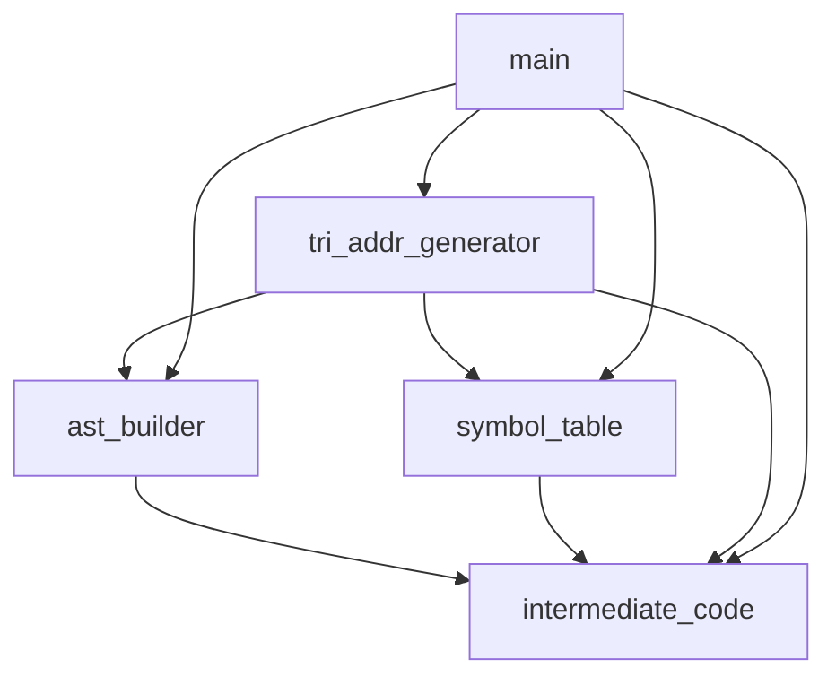

# seuIntermediate 依赖图

```mermaid
graph TD
  A[ast_builder] --> B[intermediate_code]
  C[symbol_table] --> B
  D[tri_addr_generator] --> A
  D --> B
  D --> C
  E[main] --> A
  E --> B
  E --> C
  E --> D
```
