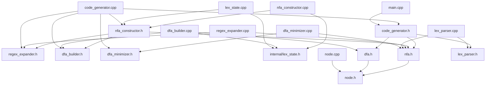
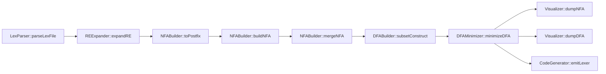
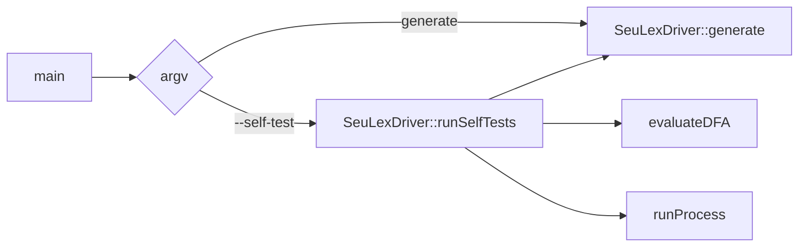
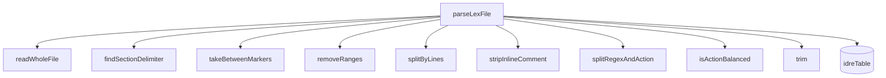
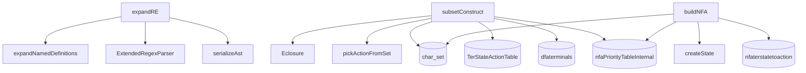
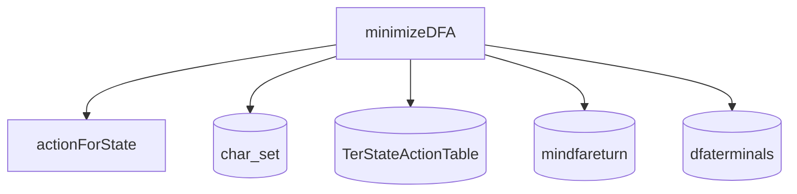
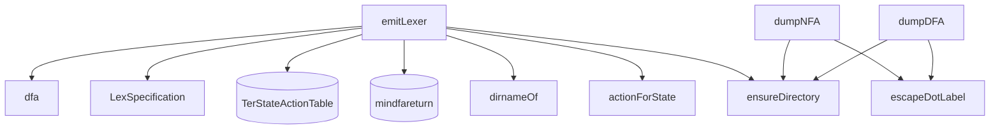

# seuLex 依赖图

## 1. 模块级依赖图

## 2. 端到端生成流程图

## 3. 运行与自测流程图

## 4. Lex 解析器内部依赖

## 5. 正则与自动机构造依赖

## 6. 最小化依赖

## 7. 代码生成依赖

## 8. 全局状态交互总结

| 组件 | 读取 | 写入 |
|---|---|---|
| `LexParser::parseLexFile` | `idreTable` | `idreTable` |
| `REExpander::expandRE` | `idreTable` | 无 |
| `NFABuilder::buildNFA` | 无 | `char_set`、`nfaterstatetoaction`、`nfaPriorityTableInternal` |
| `NFABuilder::mergeNFA` | 无 | 无 |
| `DFABuilder::subsetConstruct` | `char_set`、`nfaterstatetoaction`、`nfaPriorityTableInternal` | `TerStateActionTable`、`dfaterminals` |
| `DFAMinimizer::minimizeDFA` | `char_set`、`TerStateActionTable`、`mindfareturn` | `TerStateActionTable`、`mindfareturn`、`dfaterminals` |
| `CodeGenerator::emitLexer` | `TerStateActionTable`、`mindfareturn` | 输出文件 |
| `SeuLexDriver::generate` | 各阶段产物 | `nfaTable`、dot 文件、生成的 lexer |
| `resetGlobalTables` | 所有全局表 | 清空所有全局表 |

## 9. 依赖关系评价

`seuLex` 当前已经有明显模块边界，但依赖图里有一个很直观的现象：

- `code_generator.*` 是总控枢纽
- 全局表仍然是阶段耦合中心

这说明当前 Lex 端的单文件耦合已经下降，但状态共享仍然比 `seuYacc` 更重。
