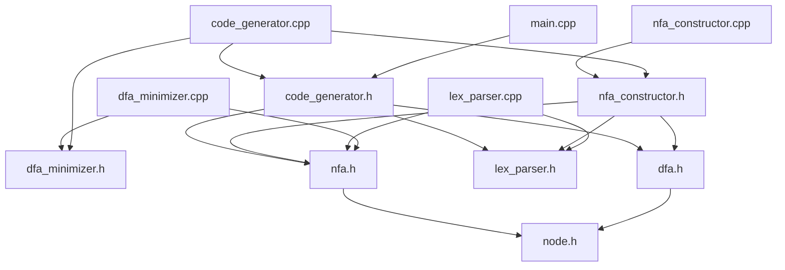
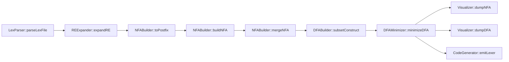
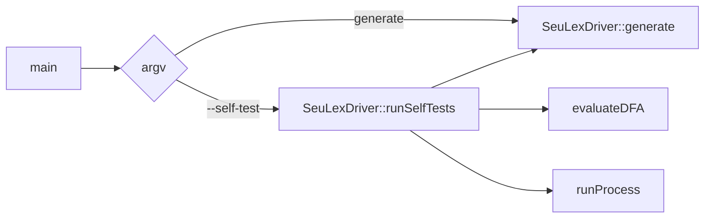
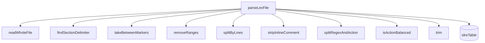
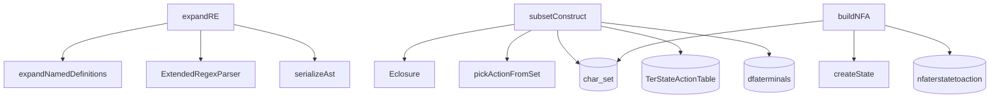
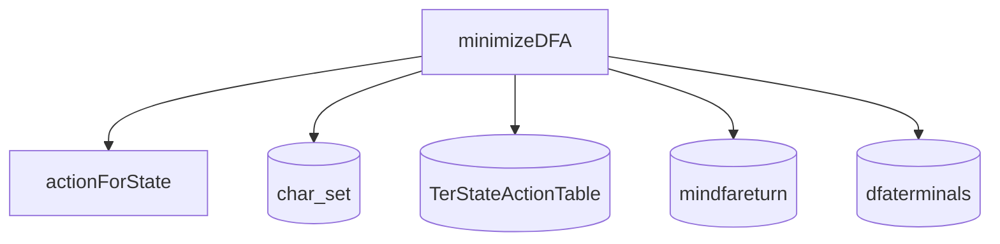
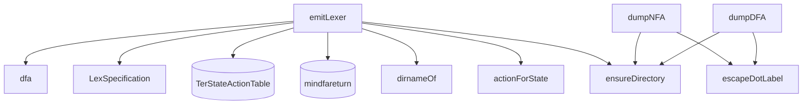

# Dependency Graph

## 1. Module-Level Dependency Graph

## 2. End-To-End Generation Pipeline

## 3. Runtime And Self-Test Flow

## 4. Lex Parser Internal Dependencies

## 5. Regex And Automaton Construction Dependencies

## 6. Minimization Dependencies

## 7. Code Generation Dependencies

## 8. Global-State Interaction Summary

| Component | Reads | Writes |
|---|---|---|
| `LexParser::parseLexFile` | `idreTable` | `idreTable` |
| `REExpander::expandRE` | `idreTable` | none |
| `NFABuilder::buildNFA` | none | `char_set`, `nfaterstatetoaction` |
| `NFABuilder::mergeNFA` | none | none |
| `DFABuilder::subsetConstruct` | `char_set`, `nfaterstatetoaction` | `TerStateActionTable`, `dfaterminals` |
| `DFAMinimizer::minimizeDFA` | `char_set`, `TerStateActionTable`, `mindfareturn` | `TerStateActionTable`, `mindfareturn`, `dfaterminals` |
| `CodeGenerator::emitLexer` | `TerStateActionTable`, `mindfareturn` | emitted file |
| `SeuLexDriver::generate` | all stage outputs | `nfaTable`, dot files, generated lexer |
| `resetGlobalTables` | all global tables | clears all global tables |
