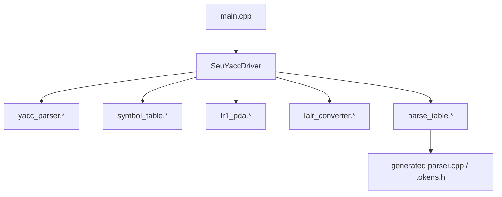
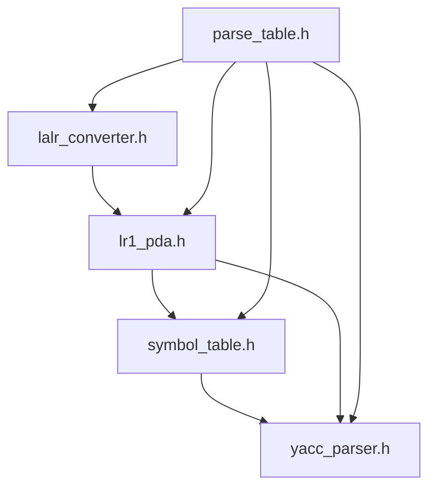
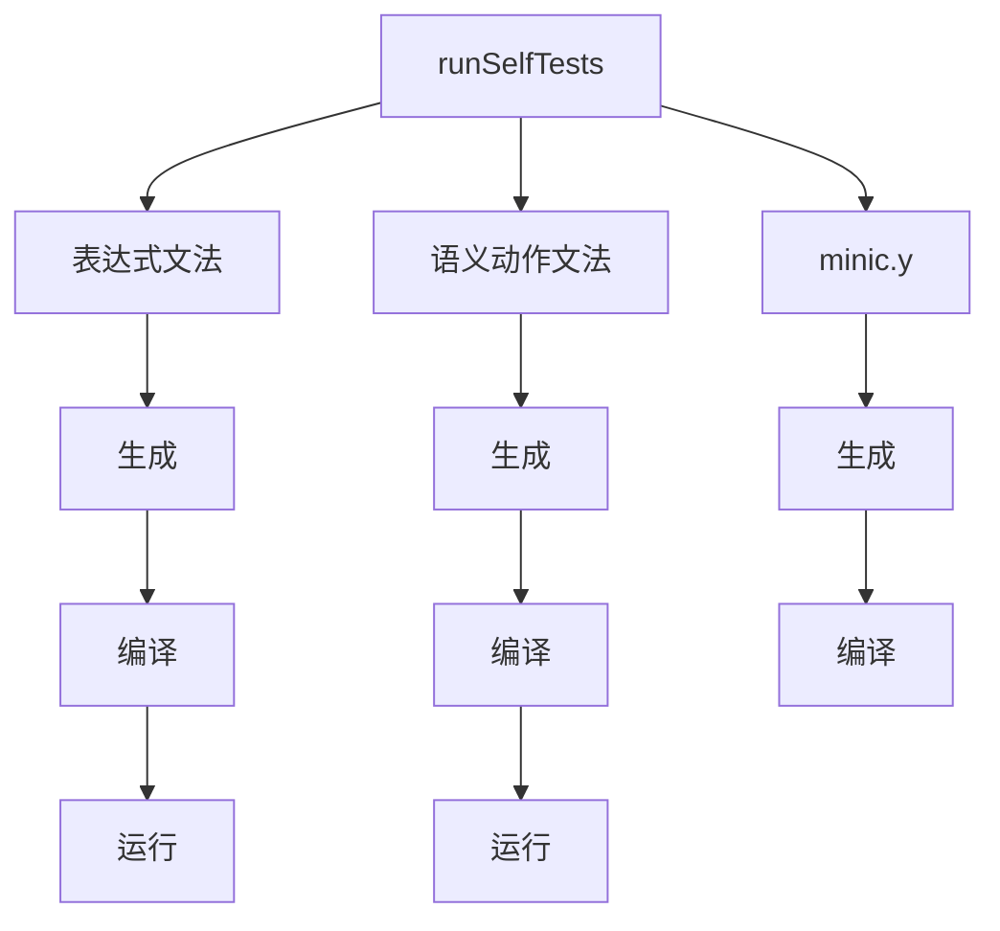
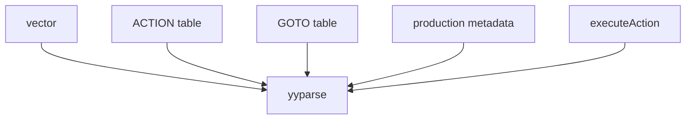

# seuYacc 依赖图

## 1. 模块依赖图



说明：

- `SeuYaccDriver` 是总控入口
- `parse_table.*` 依赖前面所有分析结果并最终输出代码
- `LALRConverter` 不是默认生成路径的必经节点，但仍是项目内的正式模块

## 2. 头文件依赖图



## 3. 生成流程图

```mermaid
flowchart TD
    A[读取 .y 文件] --> B[切分三段]
    B --> C[解析定义段]
    B --> D[解析规则段]
    C --> E[构造 YaccSpecification]
    D --> E
    E --> F[填充全局文法表]
    F --> G1[构造 canonical LR(1)]
    F --> G2[构造 direct LALR(1)]
    G1 --> H1[构建 LR(1) 表]
    G2 --> H2[构建 LALR(1) 表]
    H1 --> I[代码生成]
    H2 --> I
    I --> J[输出 parser.cpp]
    I --> K[输出 tokens.h]
```

## 4. 自测依赖图



## 5. 运行期 parser 依赖图



## 6. 依赖关系总结

最关键的工程判断有两点：

- `yacc_parser.*` 和 `lr1_pda.*` 必须松耦合，因为前者处理文本结构，后者处理形式文法
- `parse_table.*` 必须承担集成角色，但不能反过来污染头文件层级

当前结构基本满足：

- 解析、自动机构造、合并、代码生成职责分离
- 所有对外接口仍可通过 `SeuYaccDriver` 汇总使用
